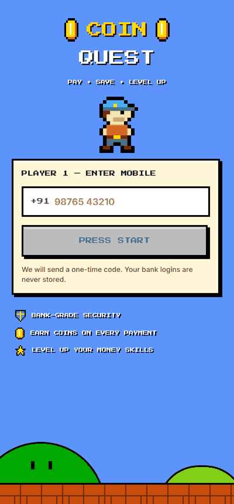
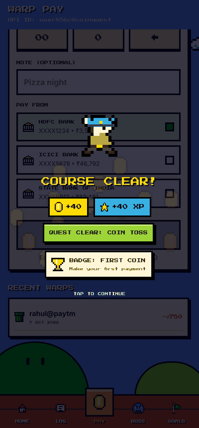
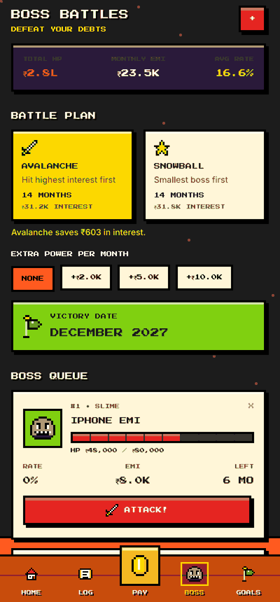
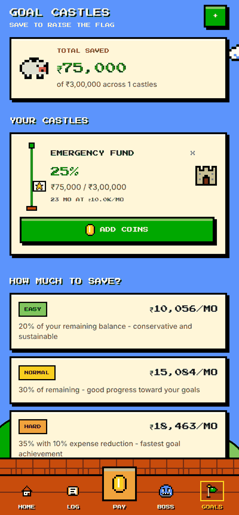
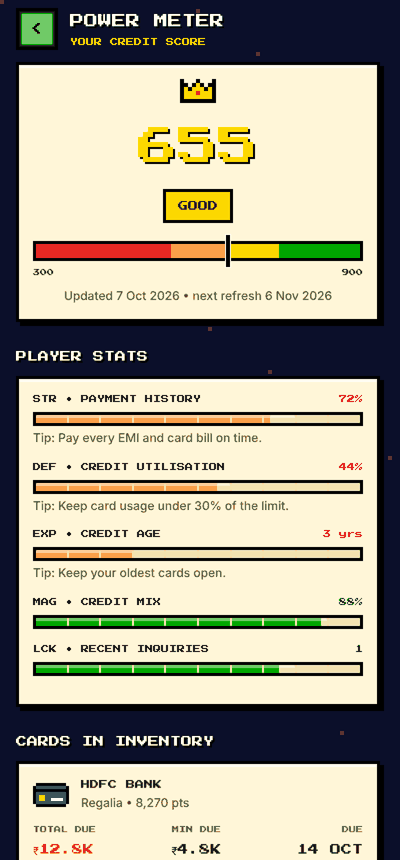
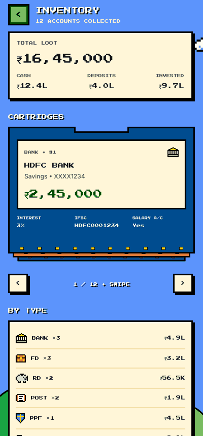

# CoinQuest

**Pay, save and level up.** CoinQuest is a fintech super-app (UPI payments, bills, credit score, rewards, loans, Account Aggregator, money lessons) wrapped in an 8-bit platformer world. Every money move is a game move: payments pop coins, bills are bricks to smash, debts are bosses with HP bars, savings goals are castles with a rising flagpole.

| Title | Home | Hold to pay | Course clear |
|---|---|---|---|
|  |  |  |  |

| Boss battles | Goal castles | Power meter | Inventory |
|---|---|---|---|
|  |  |  |  |

## The game layer

| Real feature | In-game |
|---|---|
| Dashboard | World map with a player HUD (level, coins, XP bar, world 1-1…) |
| UPI send / request | **Warp Pay**: pixel keypad + *hold-to-pay* power meter (a tap never pays) |
| Bill payments | **Bill Castle**: bricks with countdown timers, coins per bill |
| Debts (snowball / avalanche) | **Boss Battles**: HP bars, battle plans, *Attack* logs a real payment |
| Savings goals | **Goal Castles**: flagpole progress, Easy / Normal / Hard save plans |
| Credit score | **Power Meter** with RPG-style stats (payment history = STR…) |
| Rewards store | **Item Shop**: spend coins on vouchers |
| Account Aggregator | **Warp Zone**: pick institutions (pipes), see net worth |
| All accounts (bank/FD/RD/PPF/NPS) | **Inventory**: swipeable cartridge stack |
| Loans against assets | **Power-ups** with live EMI calculator |
| Financial literacy | **Academy**: level select, lessons give XP |
| Community | **Guild Hall**: leaderboard + discussions |

Server-side game engine (`backend/app/services/game.py`): XP and levels, daily check-in streaks, three rotating daily quests, nine achievements, and a leaderboard. Every money endpoint returns a `reward` block, which the app turns into a coin-burst celebration (level-ups, quest clears and badges included).

All art is original pixel art drawn in code (`frontend/src/game/sprites.ts`) and rendered as crisp SVG. There are no image assets from any existing game.

## Run it

**Backend** (Python 3.11+). Runs without MongoDB, falling back to an in-memory database:

```bash
cd backend
python -m venv .venv && source .venv/bin/activate
pip install -r requirements-dev.txt
cp .env.example .env          # optional: set MONGO_URL, OPENAI_API_KEY
uvicorn server:app --reload --port 8001
pytest                        # 17 API tests
```

**App** (Expo SDK 54):

```bash
cd frontend
yarn install
cp .env.example .env          # EXPO_PUBLIC_BACKEND_URL=http://<your-ip>:8001
yarn start                    # press w for web, or scan with Expo Go
yarn lint && npx tsc --noEmit
```

Sign in with any valid Indian mobile number. In demo mode (`DEMO_MODE=true`) the OTP is shown on screen, and new players get a starter world with demo transactions, debts and a savings goal.

## Layout

```
backend/
  app/config.py        env settings (Mongo, OpenAI, demo mode, CORS)
  app/db.py            Motor client, or mongomock when MONGO_URL is empty
  app/routers/         one module per feature (auth, upi, bills, debts, game, …)
  app/services/        game engine, debt payoff math, AI insights, demo data
  tests/               end-to-end API tests
frontend/
  app/                 expo-router screens; (tabs) = Home, Log, Pay, Boss, Goals
  src/game/            design system: theme, sprites, UI kit, GameContext, hooks
  src/services/api.ts  typed API client
```

## Production notes

The money rails are simulated. Before handling real money you need:
- **Auth:** the API trusts `user_id` in paths and bodies. Issue a session token (JWT) at OTP verification and check it on every route.
- **SMS:** send OTPs via an SMS provider and set `DEMO_MODE=false`.
- **Partners:** UPI (a PSP bank), BBPS for bills, a credit bureau, an AA (Finvu/CAMS) and a lending partner replace the mock endpoints.
- **Rate limiting** on OTP and payment endpoints.
