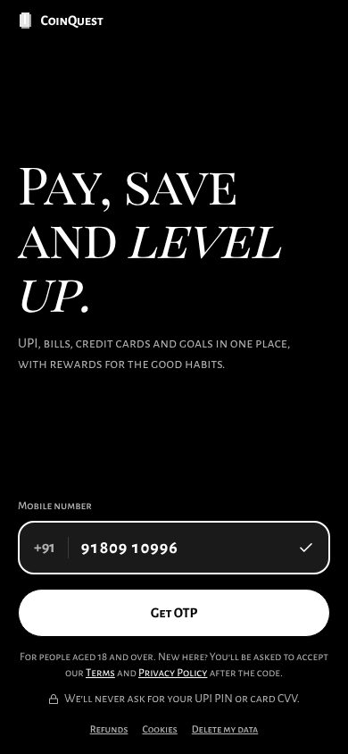
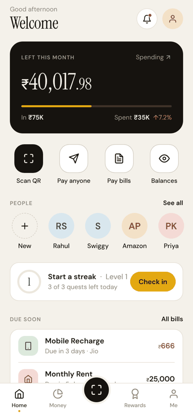
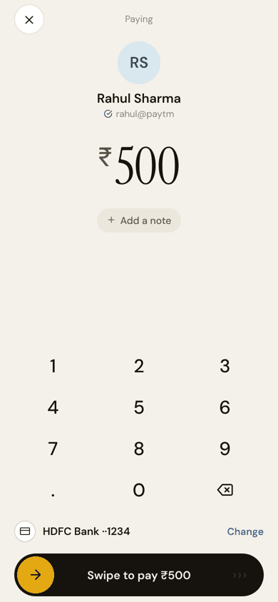
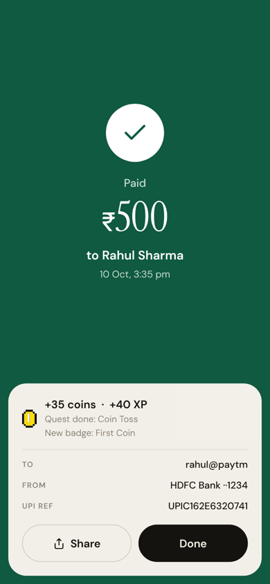
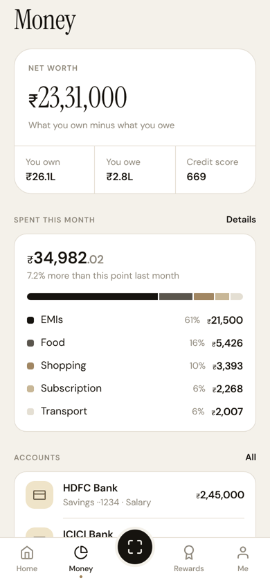
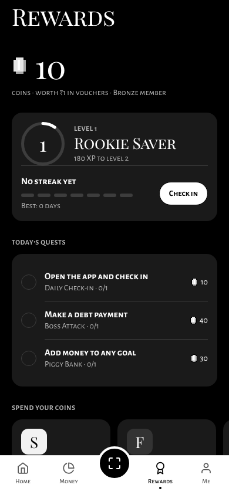
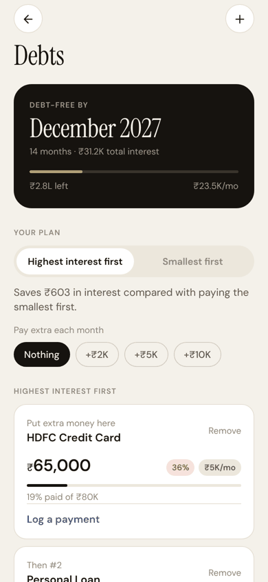
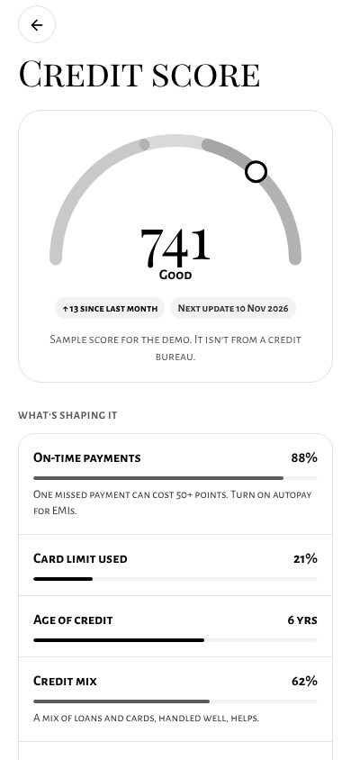

# CoinQuest

**Pay, save and level up.** CoinQuest is a UPI payments and personal-finance app: Scan & Pay, bills, credit cards and score, loans against investments, Account Aggregator, savings goals and a debt payoff planner. Good money habits earn coins, XP, streaks and badges.

The design benchmarks Google Pay, PhonePe, Paytm, CRED and 1% Club. See [docs/design/DESIGN.md](docs/design/DESIGN.md) for what we took from each, the principles, and the tokens.

| Sign in | Home | Pay | Paid |
|---|---|---|---|
|  |  |  |  |

| Money | Rewards | Debts | Credit score |
|---|---|---|---|
|  |  |  |  |

## What's in it

- **Home:** what's left this month, Scan / Pay anyone / Bills / Balances, recent people, today's streak, bills due, one insight.
- **Scan & Pay:** camera QR scanning (any UPI QR), amounts from merchant QRs are locked, a large keypad, swipe to pay (a tap can never move money), full-screen receipt.
- **Money:** net worth, spending by category, accounts, debt-free date, goals, activity.
- **Rewards:** level and XP, daily check-in streak, three daily quests, nine badges, coin store, leaderboard.
- **Debts:** avalanche vs snowball in rupees, extra-payment what-ifs, log payments.
- **Also:** credit score with factors and card bills, loans against MF/shares/FD with EMI calculator, Account Aggregator linking, goals, learn, community, security and data export.

The game engine is server-side (`backend/app/services/game.py`): every money endpoint returns a `reward` block, which the app shows as a small toast, or inline on the payment receipt.

## Run it

**Backend** (Python 3.11+). Runs without MongoDB, falling back to an in-memory database:

```bash
cd backend
python -m venv .venv && source .venv/bin/activate
pip install -r requirements-dev.txt
cp .env.example .env          # optional: set MONGO_URL, OPENAI_API_KEY
uvicorn server:app --reload --port 8001
pytest                        # 30 API tests
```

**App** (Expo SDK 54):

```bash
cd frontend
yarn install
cp .env.example .env          # EXPO_PUBLIC_BACKEND_URL=http://<your-ip>:8001
yarn start                    # press w for web, or scan with Expo Go
yarn lint && npx tsc --noEmit
```

Sign in with any valid Indian mobile number. In demo mode (`DEMO_MODE=true`) the OTP is shown on screen, and new players get a starter world with demo transactions, debts and a savings goal.

## Layout

```
backend/
  app/config.py        env settings (Mongo, OpenAI, demo mode, CORS)
  app/db.py            Motor client, or mongomock when MONGO_URL is empty
  app/routers/         one module per feature (auth, upi, bills, debts, game, …)
  app/services/        game engine, debt payoff math, AI insights, demo data
  tests/               end-to-end API tests
frontend/
  app/                 expo-router screens; (tabs) = Home, Money, Rewards, Me (+ Scan)
  src/ui/              design system: tokens, component kit, swipe-to-pay
  src/game/            game state (GameContext), reward toast, the pixel coin
  src/services/api.ts  typed API client
```

## Production notes

See **[docs/COMPLIANCE.md](docs/COMPLIANCE.md)** for how the app maps to the security, UX, architecture and reliability guidelines. It also lists what is done in code, what needs infrastructure, and what needs legal or business work. CoinQuest holds no certifications or licences yet.

The essentials:

- **Sign-in:** an OTP, then an app PIN. On a new device, both are required. Sessions are stored on the server, end after 15 minutes idle (and after 30 days at most), and are listed under Security, where you can sign them out. Payments of ₹2,000 or more need the PIN again.
- **Payments:** the states are `pending`, `success`, `failed` and `on_hold`. Each has an `Idempotency-Key`, settlement happens exactly once, and stuck payments are reconciled. Webhooks are signed and deduplicated. A circuit breaker protects against rail outages. The UPI rail and KYC provider are sandboxes. To test the different outcomes, pay `pending@coinquest`, `fail@coinquest`, `timeout@coinquest` or `outage@coinquest`.
- **Data:** PAN and date of birth are encrypted with AES-256-GCM. The audit log is hash-chained. Users can export their data or erase their account; regulated records are kept for 5 years.
- **Abuse limits:** OTPs are stored hashed and burn after 5 wrong guesses. Each phone gets 3 OTP requests per 10 minutes. A PIN locks after 5 wrong tries. Payments are limited to 10 per minute per user. All of these limits live in the database, so they hold across API instances.

Before handling real money, set these and run behind `deploy/` (nginx, TLS 1.3 only):
- `DEMO_MODE=false`
- `SECRET_KEY`
- `FIELD_ENCRYPTION_KEY`
- `WEBHOOK_SECRET`
- `ADMIN_API_KEY`
- `PUSH_ENABLED=true`

You also need these partners:
- **SMS:** a provider to send OTPs.
- **UPI:** a PSP bank.
- **KYC:** a KYC agency.
- **Bills:** BBPS.
- **Credit:** a credit bureau.
- **Account Aggregator:** an AA (Finvu/CAMS).
- **Loans:** a lending partner.

These replace the sandbox and mock endpoints.
