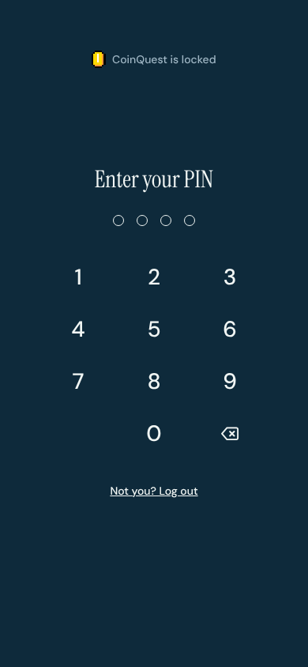
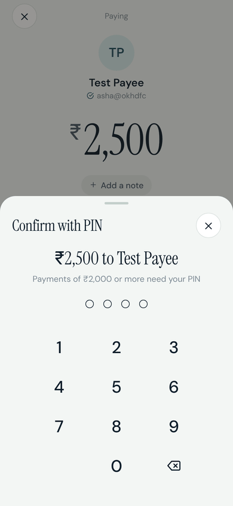
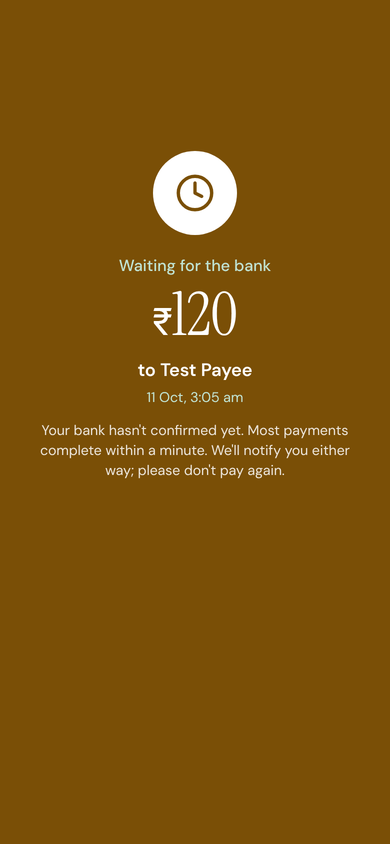
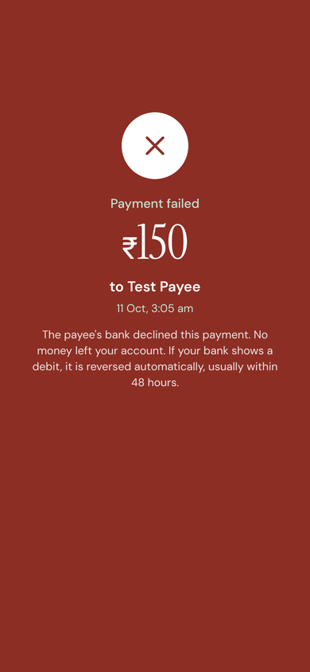
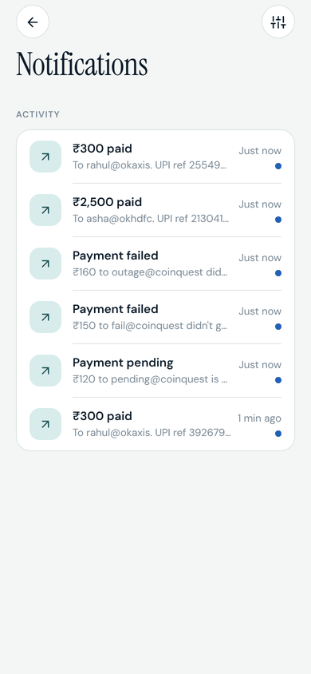
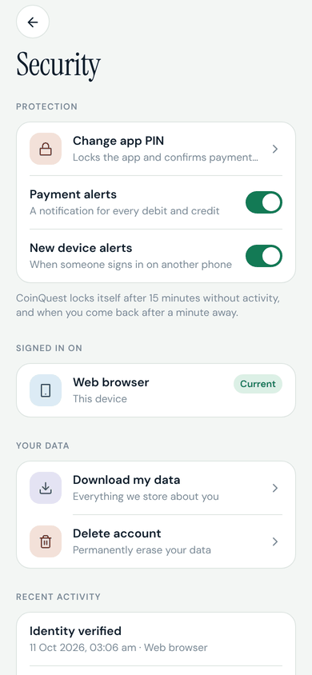
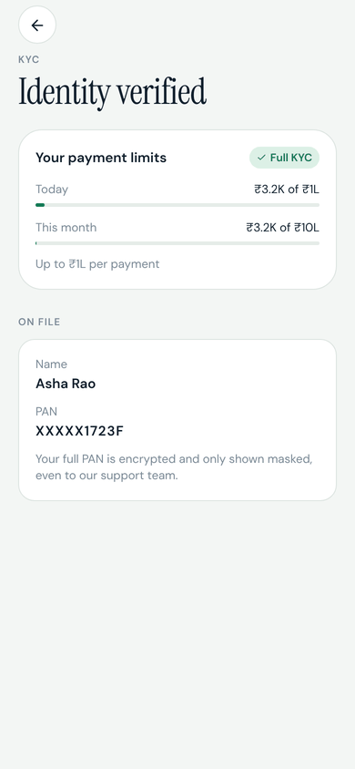
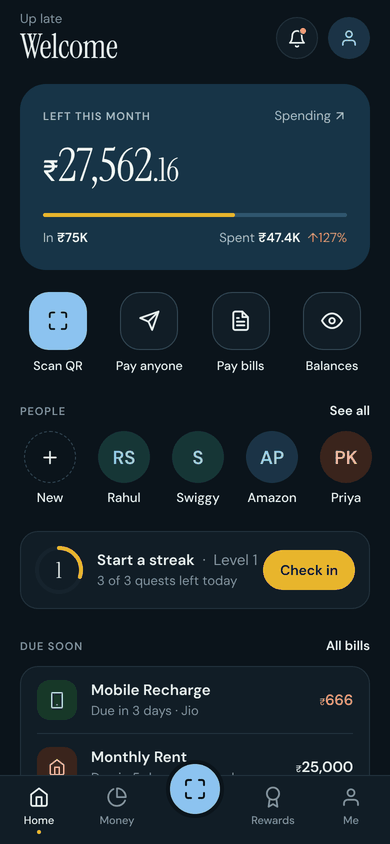

# CoinQuest

**Pay, save and level up.** CoinQuest is a UPI payments and personal-finance app with these features:
- **Payments:** Scan & Pay.
- **Bills:** paying and tracking them.
- **Credit:** credit cards and credit score, plus loans against investments.
- **Account Aggregator:** linking bank accounts.
- **Planning:** savings goals and a debt payoff planner.

Good money habits earn coins, XP, streaks and badges.

The design benchmarks Google Pay, PhonePe, Paytm, CRED and 1% Club. [docs/design/DESIGN.md](docs/design/DESIGN.md) covers what we took from each app, the design principles and the tokens. [docs/COMPLIANCE.md](docs/COMPLIANCE.md) covers security, compliance and reliability: what's done, what needs infrastructure, and what needs legal or business work.

| Sign in | Home | Pay | Paid |
|---|---|---|---|
|  |  |  |  |

| Money | Rewards | Debts | Credit score |
|---|---|---|---|
|  |  |  |  |

| App lock | PIN for ₹2,000+ | Pending | Failed |
|---|---|---|---|
|  |  |  |  |

| Alerts | Security | KYC | Dark mode |
|---|---|---|---|
|  |  |  |  |

## What's in it

- **Home:** what's left this month, plus shortcuts to Scan, Pay anyone, Bills and Balances. Also recent people, today's streak, bills due, one insight, and a bell with unread alerts.
- **Scan & Pay:**
  - Camera QR scanning works with any UPI QR, and amounts from merchant QRs are locked.
  - A large keypad, and swipe to pay: a tap can never move money.
  - Payments of ₹2,000 or more ask for your PIN.
  - The full-screen receipt shows every outcome (paid, pending, failed or on hold) with a plain explanation. A pending receipt updates itself when the bank confirms.
- **Money:** net worth, spending by category, accounts, the debt-free date, goals and activity. Tap any transaction to recategorise it, or make your own category.
- **Rewards:** level and XP, a daily check-in streak, three daily quests, nine badges, a coin store and a leaderboard.
- **Debts:** avalanche vs snowball in rupees, extra-payment what-ifs, and payment logging.
- **Me:**
  - Identity (KYC), which raises payment limits.
  - Security: change PIN, biometric unlock, signed-in devices, data export, account deletion and a security history.
  - Notification preferences.
  - Appearance: light, dark or match your phone.
- **Also:** credit score with its factors and card bills, loans against MF, shares or FD with an EMI calculator, Account Aggregator linking, goals, learn and community.

The game engine is server-side (`backend/app/services/game.py`). Every money endpoint returns a `reward` block, which the app shows as a small toast or inline on the payment receipt.

## Security and reliability

| | |
|---|---|
| **Sign-in** | An OTP, then an app PIN; Face ID or fingerprint can unlock the app on phones. Sessions live on the server and end after 15 minutes idle. The app locks on reopen, and after a minute in the background. You can sign out any device from Security. A wrong PIN 5 times locks the PIN for 15 minutes. |
| **Payments** | Each payment is in one of four states: `pending`, `success`, `failed` or `on_hold`. Retries can't charge twice (`Idempotency-Key`), and the same payee and amount within 90 seconds asks you to confirm. Stuck payments are reconciled. Bank webhooks are signed and deduplicated, and a circuit breaker handles rail outages. |
| **Compliance** | KYC tiers and limits. AML rules flag or hold suspicious payments. A hash-chained audit log records every change. PAN and date of birth are encrypted with AES-256-GCM, and card numbers are never stored. Users can export their data or delete their account; regulated records are kept for 5 years. |
| **Alerts** | Every debit, credit, failed or held payment, new-device sign-in and PIN change raises an in-app notification, plus a push notification on phones. Security alerts can't be turned off. |
| **Offline** | A banner appears when you're offline, and payments won't start until you're back. A payment interrupted by the network is checked with the server before anything is shown. |

**CoinQuest is not certified or licensed yet.** The UPI rail and KYC provider are sandboxes. See [docs/COMPLIANCE.md](docs/COMPLIANCE.md).

## Run it

**Backend** (Python 3.11+). It runs without MongoDB by falling back to an in-memory database:

```bash
cd backend
python -m venv .venv && source .venv/bin/activate
pip install -r requirements-dev.txt
cp .env.example .env          # optional: set MONGO_URL, OPENAI_API_KEY
uvicorn server:app --reload --port 8001
pytest                        # 62 tests: API, security, payments, privacy
```

**App** (Expo SDK 54):

```bash
cd frontend
yarn install
cp .env.example .env          # EXPO_PUBLIC_BACKEND_URL=http://<your-ip>:8001
yarn start                    # press w for web, or scan with Expo Go
yarn lint && npx tsc --noEmit
```

To sign in, enter any valid Indian mobile number, type the OTP, and set a PIN. In demo mode (`DEMO_MODE=true`) the OTP is shown on screen. Weak PINs such as 1234 or 1111 are refused. New players get a starter world with demo transactions, debts and a savings goal.

### Sandbox test values

| To see | Do this |
|---|---|
| A pending payment | Pay `pending@coinquest` |
| A failed payment | Pay `fail@coinquest` |
| A bank outage ("you haven't been charged") | Pay `outage@coinquest` |
| A timeout that gets reconciled | Pay `timeout@coinquest` |
| The PIN confirmation | Pay ₹2,000 or more |
| The duplicate warning | Pay the same person the same amount twice within 90 seconds |
| KYC verified | Any valid PAN, e.g. `ABCPE1234F` (each PAN works for one account only) |
| KYC failed | A PAN ending in `X`, e.g. `ABCPE1234X` |

## Configuration

Backend settings go in `backend/.env` (see `.env.example`):

| Variable | Default | Purpose |
|---|---|---|
| `MONGO_URL`, `DB_NAME` | in-memory | Database. Leave `MONGO_URL` empty for the in-memory fallback |
| `DEMO_MODE` | `true` | Shows the OTP on screen and seeds demo data. **Must be `false` in production** |
| `SECRET_KEY` | random per run | Signs session tokens. Without it, sessions end when the server restarts |
| `FIELD_ENCRYPTION_KEY` | random per run (demo only) | AES-256 key (base64, 32 bytes) for PAN and DOB. The API won't start without it outside demo mode |
| `WEBHOOK_SECRET` | | Shared with the payment partner to sign webhooks |
| `ADMIN_API_KEY` | admin API off | Enables `/api/admin/*`: audit verification, AML alerts, reconciliation |
| `REQUIRE_HTTPS` | on outside demo | Refuses plain-HTTP requests |
| `IDLE_TIMEOUT_MINUTES` | `15` | Session idle timeout |
| `PUSH_ENABLED` | `false` | Sends Expo push notifications |
| `OPENAI_API_KEY` | | Optional AI insights and auto-categorisation; falls back to rules |
| `CORS_ORIGINS` | `*` | Allowed web origins |

## Deploy

`deploy/` contains a production setup:
- **`docker-compose.yml`:** three services:
  - MongoDB, with auth.
  - The API, built from `backend/Dockerfile`, which runs as a non-root user and has a healthcheck.
  - An nginx proxy in front of the API.
- **`nginx.conf`:** the proxy's config, which allows only TLS 1.3 and sends HSTS.

Copy `deploy/.env.example` to `deploy/.env`, fill in the secrets, then run:

```bash
cd deploy && docker compose up -d
```

Schedule `POST /api/admin/payments/reconcile` (with the `X-Admin-Key` header) every minute.

Before handling real money, you need these partners; they replace the sandbox and mock endpoints:
- **SMS:** a provider to send OTPs.
- **UPI:** a PSP bank.
- **KYC:** a KYC agency.
- **Bills:** BBPS.
- **Credit:** a credit bureau.
- **Account Aggregator:** an AA (Finvu/CAMS).
- **Loans:** a lending partner.

Legal and certification steps are listed in [docs/COMPLIANCE.md](docs/COMPLIANCE.md).

## Layout

```
backend/
  app/config.py        env settings
  app/auth.py          sessions, idle timeout, PIN hashing and lockout, PIN step-up
  app/db.py            Motor client, or mongomock when MONGO_URL is empty
  app/routers/         one module per feature (auth, upi, kyc, notifications, webhooks, admin, …)
  app/services/        payments (rail, idempotency, settlement), audit, kyc, aml, crypto,
                       notify, privacy, pci, game engine, debt math, AI insights, demo data
  tests/               API, security, payments and privacy tests
  Dockerfile
frontend/
  app/                 expo-router screens; (tabs) = Home, Money, Rewards, Me (+ Scan)
  src/ui/              design system: themes, component kit, PIN pad, app lock, swipe-to-pay
  src/game/            game state (GameContext), reward toast, the pixel coin
  src/services/        typed API client, push registration, receipts
deploy/                docker-compose, nginx (TLS 1.3), production env template
docs/                  design notes, compliance matrix, screenshots
```
